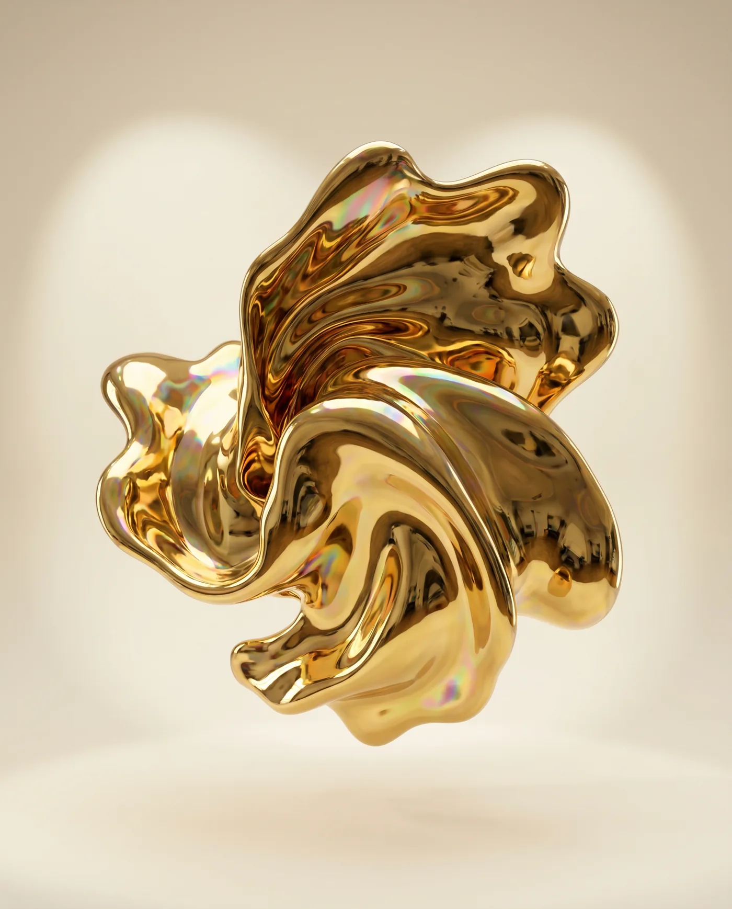

# AUREA — *Objects that shouldn't exist*

A cinematic, scroll-driven brand experience for a **fictional digital-sculpture atelier**.
Warm ivory canvas, molten-gold light, editorial serif — an award-style single page built
around a living, breathing 3D gold form that morphs and drifts as you scroll.

**Live 3D. Buttery smooth scroll. Fully responsive.**



---

## ✦ Highlights

- **Real-time WebGL centrepiece** — a high-detail icosphere driven by a custom GLSL
  vertex-displacement shader (3-octave simplex noise) with re-computed normals, wrapped in a
  physically-based gold material (clearcoat + iridescence) lit by an AI-generated studio HDRI.
- **Scroll choreography** — the form is posed, scaled, rotated and revealed section-by-section
  via GSAP ScrollTrigger; it hides behind the dark "Works" chapter and returns for the manifesto.
- **Buttery smooth scrolling** — [Lenis](https://github.com/darkroomengineering/lenis) wired
  into the GSAP ticker for a single, lag-free RAF loop.
- **Horizontal pinned gallery**, masked line reveals, word-by-word statement ink-in, animated
  counters, custom cursor, film grain, and a rAF-safe preloader.
- **Performance & a11y aware** — DPR caps, lower geometry detail + fewer particles on mobile,
  `prefers-reduced-motion` fallback, touch/hover feature detection.

## ✦ Tech

| Layer | Stack |
|---|---|
| 3D | [Three.js](https://threejs.org) `r160` — `MeshPhysicalMaterial` + `onBeforeCompile` shader injection, `PMREMGenerator` |
| Motion | [GSAP](https://gsap.com) 3 + ScrollTrigger |
| Smooth scroll | [Lenis](https://github.com/darkroomengineering/lenis) 1 |
| Type | Fraunces (serif) + Inter |
| Build | None — native ES modules via import-map + CDN |

## ✦ Generated assets

The environment map (studio HDRI) and the four gallery sculptures were generated with
**[Higgsfield](https://higgsfield.ai)** (`nano_banana` image model), then optimised to
WebP/JPEG. Everything else — geometry, shading, lighting, motion — is code.

## ✦ Run it

No build step. Serve the folder over HTTP (ES modules need a server):

```bash
# Python
python -m http.server 8092
# then open http://localhost:8092
```

## ✦ Structure

```
aurea/
├─ index.html      # markup + import-map
├─ styles.css      # design system (ivory / gold / obsidian)
├─ main.js         # Three.js scene, shaders, scroll choreography
└─ assets/
   ├─ env/studio.jpg     # HDRI for gold reflections
   └─ img/*.webp         # gallery sculptures
```

---

*AUREA is a fictional concept created as a portfolio / demo piece. © MMXXVI.*
